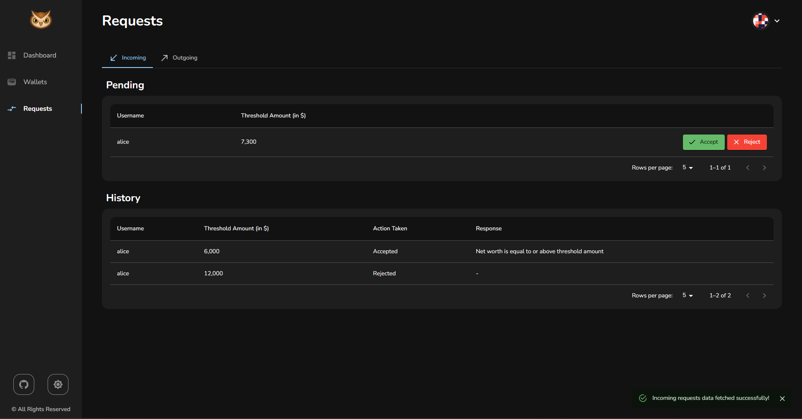
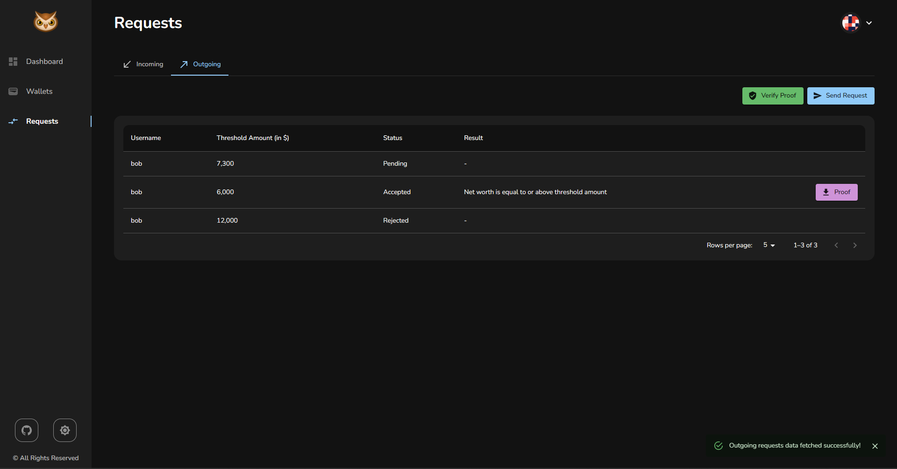

# ZK Worth

This is a project made by [Kevin Joshi](https://github.com/KevinJ-hub), [Kaushal Binjola](https://github.com/KaushalBinjola), [Rajas Bondale](https://github.com/Rajas-B) & [Neelansh Mathur](https://github.com/neelansh15).  
It is hosted on [Render](https://render.com/), you can check it out [here](https://zk-worth.onrender.com/), the details are encrypted and stored on Polygon Mumbai test network with the zkp being stored on ipfs which is deployed using the api provided by [web3.storage](https://web3.storage/). The frontend UI and dashboard charts are generated using [MUI](https://mui.com/) and [React Chartjs 2](https://react-chartjs-2.js.org/) respectfully.  

> **NOTE:** Since the app is hosted for free on render it goes to sleep on 15 mins of inactivity so there might be a possibility that the app takes a few seconds to load INITIALLY so please be patient.  

- Use ZK Worth to prove your assets are above a threshold without revealing your wallet addresses or on-chain activity.
- For example, universities accepting international students may require the applicants to provide proof that they can afford the expenses, including assets on the blockchain. But if the applicant doesn't want to share their exact cryptocurrency balances and on-chain activity, they can use ZK Worth.
- Using ZK Worth, the university can request proof for a specific threshold, and the applicant can choose to provide that proof. This is done using Zero Knowledge Proofs.
- All the data is securely encrypted and stored on blockchain using asymmetric encryption and the user is the only person who can access their data using the private key provided during registration.  

## Tech Used

- Blockchain
- Solidity
- Circom 2
- Hardhat
- Ipfs
- Reactjs
- Nodejs
- Expressjs

## Flow Diagram

## Running this project

1. Clone the repository
2. Generate Zero Knowledge Proof (zkp) setup files by following the instructions given in the README file present in [zkp folder](zkp/) (OPTIONAL)
3. Deploy the smart contracts by following the instructions given in the README file present in [hardhat-project folder](hardhat-project/) (OPTIONAL)
4. Run the webapp by following the instructions given in the README file present in [webapp folder](webapp/)

## Images

### Desktop

---

---

---

---

